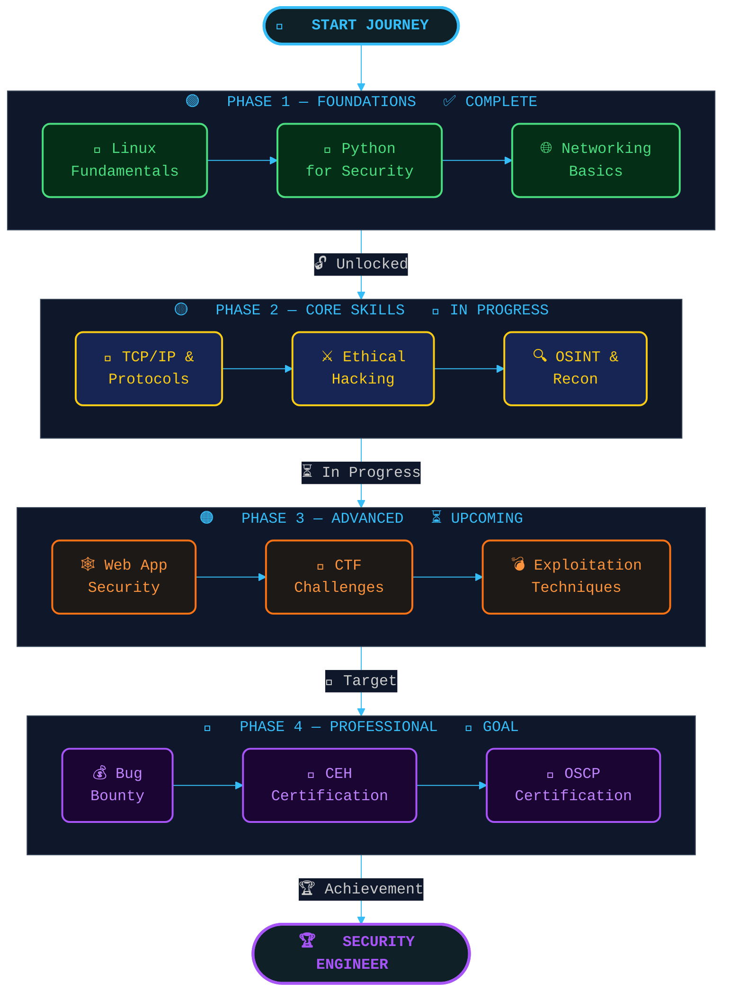

<div align="center">

<!-- Animated Banner -->


<!-- Typing SVG -->


<br/>

<!-- Social Badges -->
<a href="https://linkedin.com/in/nirupam-pal-166614291">
  
</a>
<a href="https://instagram.com/nirupam.1">
  
</a>
<a href="mailto:palnirupam7@gmail.com">
  
</a>


</div>

---

## 🧑‍💻 About Me

```python
class NirupamPal:
    def __init__(self):
        self.name        = "Nirupam Pal"
        self.role        = ["Developer", "Cybersecurity Learner", "Tech Explorer"]
        self.languages   = ["Python", "Java", "C", "HTML"]
        self.os          = "Kali Linux 🐉"
        self.interests   = ["Ethical Hacking", "Web Development", "Open Source"]
        self.ask_me      = ["Python", "Cybersecurity Basics", "Linux Tips"]
        self.goals       = "Hack the system — but secure it first. 🔐"

    def say_hi(self):
        print("Thanks for visiting my profile! Let's build something cool together.")

me = NirupamPal()
me.say_hi()
```

---

## 🚀 What I'm Up To

<table>
  <tr>
    <td>🔭</td>
    <td>Sharpening my <strong>development & cybersecurity</strong> skills daily</td>
  </tr>
  <tr>
    <td>🌱</td>
    <td>Deep-diving into <strong>Ethical Hacking & Web Development</strong></td>
  </tr>
  <tr>
    <td>🤝</td>
    <td>Open to <strong>collaborations</strong> on exciting projects</td>
  </tr>
  <tr>
    <td>💬</td>
    <td>Feel free to ask me about <strong>Python & Cybersecurity</strong></td>
  </tr>
  <tr>
    <td>⚡</td>
    <td>Proud <strong>Kali Linux</strong> user — my weapon of choice 🐉</td>
  </tr>
  <tr>
    <td>🎯</td>
    <td>Goal: Become a skilled <strong>Security Engineer</strong></td>
  </tr>
</table>

---

## 🛠️ Tech Stack

<div align="center">

### 💻 Languages


### 🔧 Tools & Platforms


### 🔐 Cybersecurity


</div>

---

## 📊 GitHub Stats

<div align="center">


<br/><br/>


</div>

---

## 📈 Contribution Activity

<div align="center">
  
</div>

---

## 🏆 GitHub Trophies

<div align="center">
  
</div>

---

## 🛡️ Cybersecurity Roadmap

<div align="center">



</div>

<br/>

<div align="center">

### 📍 Live Progress Tracker

| # | Phase | Skill | Status | Level |
|:-:|:-----:|:------|:------:|:-----:|
| 🟢 | `PHASE 1` | 🐧 Linux Fundamentals | `✅ DONE` |  |
| 🟢 | `PHASE 1` | 🐍 Python for Security | `✅ DONE` |  |
| 🟢 | `PHASE 1` | 🌐 Networking Basics | `✅ DONE` |  |
| 🟡 | `PHASE 2` | 📡 TCP/IP & Protocols | `🔄 ACTIVE` |  |
| 🟡 | `PHASE 2` | ⚔️ Ethical Hacking | `🔄 ACTIVE` |  |
| 🟡 | `PHASE 2` | 🔍 OSINT & Recon | `🔄 ACTIVE` |  |
| 🟠 | `PHASE 3` | 🕸️ Web App Security | `⏳ NEXT` |  |
| 🟠 | `PHASE 3` | 🏁 CTF Challenges | `⏳ NEXT` |  |
| 🟠 | `PHASE 3` | 💣 Exploitation | `⏳ NEXT` |  |
| 🔴 | `PHASE 4` | 💰 Bug Bounty Hunting | `🎯 GOAL` |  |
| 🔴 | `PHASE 4` | 📜 CEH Certification | `🎯 GOAL` |  |
| 🔴 | `PHASE 4` | 🏅 OSCP Certification | `🏆 DREAM` |  |

> 💡 *Update your progress regularly — this tracker shows your cybersecurity journey in real time!*

</div>

---

<div align="center">

### 🧠 Hacker's Mantra

> *"The quieter you become, the more you are able to hear."*  
> — Kali Linux Motto

---


</div>
